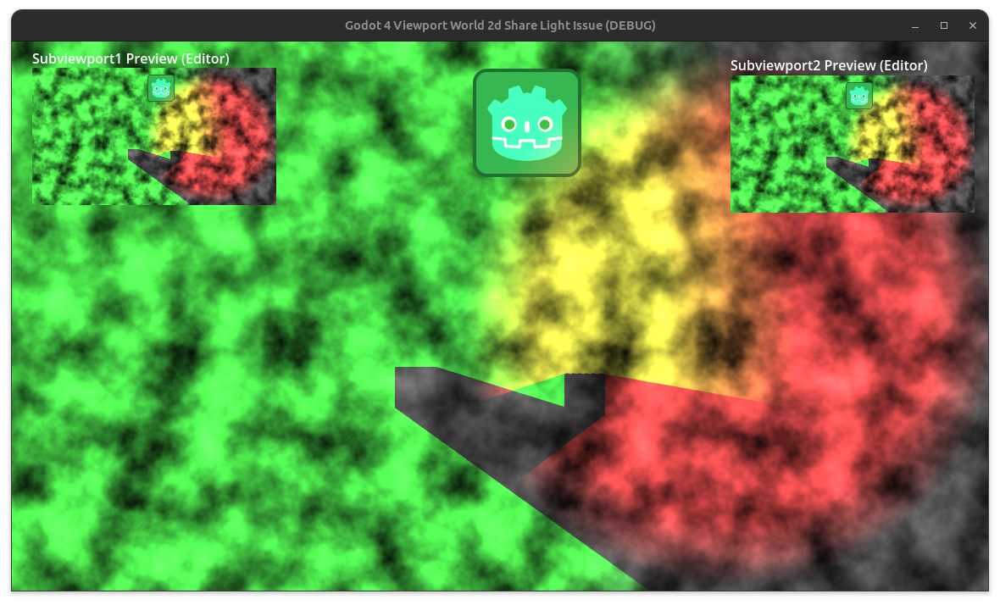

# Missing Lights When Sharing SubViewport World2D's in Godot 4
Latest Godot Version replicable in: Godot 4.2.beta3.
  
When the world_2d of one SubViewport is assigned to another, the lights in the second SubViewport do not re-attach themselves to the canvas of that world_2d.
  
Here is how such a scene looks in the editor.  The green light is from SubViewport1 and the red light is from SubViewport2.
  
</img>
  
In the scene's _ready() function the world_2d of Subviewport1 is assigned to Subviewport2.  Here the red light is missing.
  
</img>
  
A workaround for this is to remove and then add the light back to the scene tree.
  
</img>
  
This works because the light attaches itself to the canvas with the NOTIFICATION_ENTER_TREE notification.  Other similiar nodes, like LightOccluder2D do their attachment for the NOTIFICATION_ENTER_CANVAS notification.

